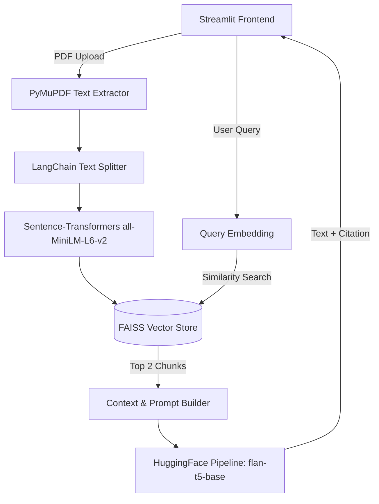
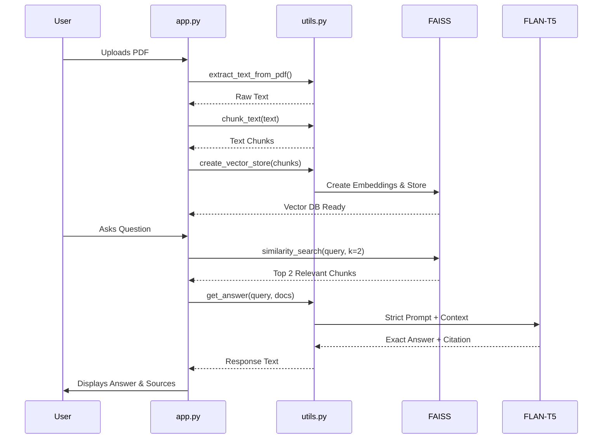

# Complete Project Viva Guide: AI Financial Report Analyzer

## 1. Project Overview
**What the project does:**
The AI Financial Report Analyzer is a Retrieval-Augmented Generation (RAG) system built to parse, index, and analyze complex PDF financial documents. It acts as an interactive intelligence dashboard where a user can upload a financial report (e.g., balance sheets, annual reports) and ask natural language questions. The AI extracts exact numerical values and text, explicitly citing the document reference to prevent hallucinations.

**Problem being solved:**
Financial reports are often hundreds of pages long and dense with numerical data, making manual extraction tedious and error-prone. Standard Large Language Models (LLMs) tend to "hallucinate" numbers when asked about specific financial metrics if they don't have exact context. This project solves this by forcing the AI to extract data *only* from the uploaded document and proving its accuracy via citations.

**Real-world use cases:**
- **Auditing & Compliance:** Auditors can quickly verify debt-to-equity ratios or revenue numbers across massive documents.
- **Investment Analysis:** Analysts can rapidly extract EPS, profit margins, and liabilities without manually reading 10-K filings.
- **Corporate Finance:** Internal teams can perform rapid QA on their own financial drafts.

**Expected outputs:**
When a user asks a question (e.g., "What is the total revenue for 2023?"), the application outputs:
1. The extracted numerical answer in a clear sentence.
2. A citation to the specific document chunk (e.g., "[Reference 1]").
3. The raw, exact text snippet from the document proving the answer.

---

## 2. Complete Workflow Explanation

1. **User Input:** The user accesses the Streamlit UI and uploads a `.pdf` file.
2. **Text Extraction:** The file is saved temporarily. PyMuPDF (`fitz`) opens the PDF and extracts all raw text page by page.
3. **Chunking:** The LangChain `RecursiveCharacterTextSplitter` divides the massive text block into smaller, overlapping chunks (1000 characters each, with 100 character overlap). This preserves context while fitting into the AI's memory limits.
4. **Embedding Creation:** The text chunks are passed through the `sentence-transformers/all-MiniLM-L6-v2` model, converting sentences into high-dimensional numerical vectors (embeddings) based on semantic meaning.
5. **Vector Storage:** These vectors are loaded into a FAISS (Facebook AI Similarity Search) database.
6. **Query Phase:** The user types a financial question. The system embeds this question using the same MiniLM model.
7. **Semantic Retrieval:** FAISS compares the question's vector against all document vectors and retrieves the top 2 most semantically relevant text chunks.
8. **Prompt Construction:** The retrieved chunks are formatted as explicitly labeled references (`[Reference 1]`, `[Reference 2]`) and combined with a strict extraction prompt.
9. **LLM Generation:** The prompt is sent to `google/flan-t5-base` via HuggingFacePipeline. The LLM reads the context, extracts the exact answer, and cites the reference number.
10. **UI Rendering:** The result, along with the source text and chat history, is rendered dynamically in the Deep Space styled Streamlit UI.

---

## 3. Architecture Explanation

### High-Level Architecture Diagram

### Data Flow Diagram

**Component Interaction Explanation:**
- **Frontend (`app.py`)** acts as the controller, managing session state (history, UI renders, caching the LLM).
- **Processing Engine (`utils.py`)** acts as the service layer, communicating with external ML models (HuggingFace, FAISS) and document parsers.

---

## 4. Code Explanation

### 1. `app.py` (The Interface & Controller)
- **Role:** Handles the web interface, dark mode CSS, session state, routing, and user interaction.
- **Logic:** 
  - Initializes the LLM (`st.session_state.llm`) and vector store.
  - Custom CSS (`st.markdown`) implements the "Deep Space" theme (gradients, glassmorphism).
  - Sidebar manages PDF uploads, saving them to `temp_uploads/`.
  - Main column tracks chat history (`active_chat_idx`) allowing users to click past questions to render old answers immediately without re-querying the model.

### 2. `utils.py` (The Intelligence Engine)
**Major Functions:**

- `extract_text_from_pdf(pdf_path)`
  - *Input:* Path to the saved PDF.
  - *Internal Logic:* Uses `fitz` (PyMuPDF) to iterate through pages and extract string text.
  - *Output:* A single concatenated string.

- `chunk_text(text)`
  - *Input:* Massive string of text.
  - *Internal Logic:* Uses Langchain's `RecursiveCharacterTextSplitter`. Cuts text into 1000 character pieces. Uses an overlap of 100 characters so sentences cut in half aren't totally lost.
  - *Output:* List of string chunks.

- `create_vector_store(chunks)`
  - *Input:* List of string chunks.
  - *Internal Logic:* Initializes `HuggingFaceEmbeddings` with the MiniLM model. Passes chunks to `FAISS.from_texts()` which converts text to mathematical vectors and indexes them.
  - *Output:* FAISS vector store object.

- `load_llm()`
  - *Internal Logic:* Loads the `google/flan-t5-base` tokenizer and Seq2Seq model. Creates a HuggingFace text generation pipeline with `max_length=512` and low `temperature=0.1` for deterministic answers.
  - *Output:* LangChain `HuggingFacePipeline` wrapper.

- `get_answer(query, vector_store, llm)`
  - *Input:* User string query, FAISS store, LLM pipeline.
  - *Internal Logic:* Queries FAISS for top `k=2` chunks. Formats the chunks as `[Reference 1]` and `[Reference 2]`. Wraps this inside a strict system prompt explicitly telling the model to extract data and cite the reference. Calls `llm.invoke()`.
  - *Output:* The generated string answer and the raw source documents.

---

## 5. Technology Analysis

* **Python:** Core programming language.
* **Streamlit:** Chosen for frontend development. *Why:* Allows rapid creation of data dashboards in pure Python without writing React/JS.
* **LangChain:** Chosen as the LLM orchestration framework. *Why:* Makes connecting document loaders, splitters, vector stores, and LLMs extremely modular.
* **FAISS (Facebook AI Similarity Search):** Chosen for vector database. *Why:* Extremely fast, runs locally on CPU, no need for external cloud DBs like Pinecone.
* **PyMuPDF (fitz):** Chosen for PDF parsing. *Why:* Faster and more accurate than PyPDF2, especially for dense text.
* **HuggingFace Hub:** Source of open-source models. *Why:* Keeps the project 100% free and local, avoiding OpenAI API costs and data privacy concerns.

---

## 6. Model Analysis

### 1. `sentence-transformers/all-MiniLM-L6-v2`
- **Role:** Embedding model.
- **Architecture:** 6-layer Transformer architecture (distilled version of BERT).
- **Working Principle:** Converts sentences into a 384-dimensional dense vector space. Sentences with similar meanings are mapped physically closer together in this space.
- **Strengths:** Lightning-fast, very small (under 100MB), great for semantic search.
- **Limitations:** Limited context window length.

### 2. `google/flan-t5-base`
- **Role:** Answer Generator.
- **Architecture:** Encoder-Decoder Transformer (T5 architecture).
- **Working Principle:** Fine-tuned on a massive mixture of tasks (FLAN) making it excellent at zero-shot instruction following. 
- **Input/Output:** Takes the context and prompt (Text) -> Outputs exact answer (Text).
- **Strengths:** Small enough to run locally without a GPU (250M parameters). Very good at strict extractive QA.
- **Limitations:** Max token limit of 512 tokens. Prone to hallucination if asked to "reason" rather than "extract", which is why the strict prompt design is crucial.

---

## 7. System Interconnection

1. The user interacts entirely with the **Streamlit UI (`app.py`)**.
2. When a file is uploaded, the UI passes file I/O control to Python's `os` module, then calls **`utils.py`** to extract and chunk.
3. **LangChain** bridges the text arrays into **FAISS**.
4. **FAISS** talks to the **MiniLM Embedding Model** to index the data.
5. When querying, the UI passes the string to **`utils.py`**, which queries FAISS, builds the prompt, and hands it to the **FLAN-T5 model** via **HuggingFace Pipeline**.
6. The output flows backwards to the UI, which updates `st.session_state` to render history.

---

## 8. Advantages
- **Data Privacy:** 100% local processing. No proprietary financial data is sent to external APIs (like ChatGPT).
- **Hallucination Prevention:** Strict prompting with forced references ensures trust in the AI's output.
- **Cost Effective:** Uses free open-source models, eliminating API token costs.
- **Highly Responsive UI:** The Streamlit cache and session states make history navigation instant.

---

## 9. Limitations
- **Token Limits:** FLAN-T5-base has a strict 512-token limit. We had to restrict context retrieval to 2 chunks (`k=2`) to prevent crashes, potentially missing data in huge documents.
- **CPU Bottleneck:** Running LLMs on a CPU locally can take a few seconds per query compared to cloud APIs.
- **Table Parsing:** PyMuPDF extracts raw text. Complex nested tables in financial PDFs might lose structural meaning when flattened to strings.

---

## 10. Future Scope
- **GPU Acceleration:** Implement CUDA support for faster LLM inference.
- **Advanced Parsing:** Integrate OCR or `pdfplumber` to better retain tabular financial data structures.
- **Model Upgrade:** Swap `flan-t5-base` for a quantized modern model like `Llama-3-8B-Instruct` for advanced reasoning, provided the hardware allows it.
- **Multi-Document RAG:** Expand FAISS to handle a whole directory of PDFs (e.g., comparing 2022 vs 2023 reports).

---

## 11. Viva Questions (50 Questions & Answers)

### Basic Questions
1. **What is RAG?** Retrieval-Augmented Generation. It gives an LLM external data to read before answering.
2. **What does the project do?** It analyzes financial PDFs locally and extracts answers with exact citations.
3. **Why did you use Streamlit?** For rapid, pure-Python UI dashboard development.
4. **What library extracts the PDF text?** PyMuPDF (`fitz`).
5. **Why not just send the whole PDF to the LLM?** LLMs have strict memory/token limits. You can't fit a 100-page PDF into a standard 512-token model.

### Technical & Code Questions
6. **What is chunking?** Breaking large text into smaller segments (chunks) so they fit in the LLM's memory.
7. **What chunk size did you use and why?** 1000 characters with 100 overlap. Ensures sentences aren't cut mid-way and context is retained.
8. **What does `RecursiveCharacterTextSplitter` do?** It splits text hierarchically (by paragraphs, then sentences, then words) to keep semantic meaning intact.
9. **How is the chat history maintained?** Using `st.session_state.history` and `st.session_state.active_chat_idx`.
10. **Why do we need a temporary folder (`temp_uploads`)?** PyMuPDF requires a physical file path to parse the document; Streamlit uploads exist in memory first.

### Architecture Questions
11. **Explain the data flow of your project.** Upload -> Extract -> Chunk -> Embed -> Store (FAISS) -> Query -> Retrieve Top K -> Prompt LLM -> Output.
12. **What is FAISS?** Facebook AI Similarity Search. A library for fast, dense vector similarity searching.
13. **Why use FAISS over a standard database?** Standard databases search by keywords (SQL). FAISS searches by "meaning" using vector cosine similarity.
14. **Is your system connected to the internet to answer questions?** No, the LLM and vector database run 100% locally.
15. **How does the frontend communicate with the backend?** There is no separate backend server. It's a monolithic Streamlit script where `app.py` directly imports and executes `utils.py`.

### Embedding & Vector Questions
16. **What is an embedding?** A list of numbers (a vector) representing the semantic meaning of a piece of text.
17. **Which embedding model did you use?** `all-MiniLM-L6-v2`.
18. **Why MiniLM?** It is lightweight, fast for CPU execution, and highly accurate for English text.
19. **What is Semantic Search?** Finding text that means the same thing as the query, even if they don't share exact words.
20. **How does FAISS measure similarity?** Typically using L2 (Euclidean) distance or Cosine Similarity between vectors.

### LLM / Model Questions
21. **Which LLM did you use?** `google/flan-t5-base`.
22. **What does FLAN stand for?** Fine-tuned Language Net. It means the model was heavily trained on instruction-following tasks.
23. **What is a Seq2Seq model?** Sequence-to-Sequence. It takes an input sequence of text and generates an output sequence.
24. **Why didn't you use GPT-4?** To ensure 100% data privacy for financial documents and to keep the project open-source/free.
25. **Why set temperature to 0.1?** Low temperature makes the AI deterministic and factual, reducing the chance of hallucinating fake financial numbers.
26. **What is `max_length` in your pipeline?** It restricts the generated output length to prevent infinite loops and memory crashes.

### Engineering & Debugging Questions
27. **We saw an error "Token indices sequence length is longer than the specified maximum". What was that?** The T5 model has a hard limit of 512 tokens. We were passing 3 chunks of 1000 characters, which exceeded the limit.
28. **How did you fix the token limit error?** By reducing the similarity search `k` from 3 to 2, ensuring the prompt fits inside the 512-token window.
29. **Why did the model sometimes just output a random number originally?** Small models optimize for brevity. The original prompt wasn't strict enough about generating NLP sentences.
30. **How did you fix the hallucination/formatting issue?** Implemented a strict prompt design injecting explicit `[Reference X]` tags and forcing the model to cite them.

### UI / Streamlit Questions
31. **How is the dark theme implemented?** Using custom CSS injected via `st.markdown(..., unsafe_allow_html=True)`.
32. **What is `st.spinner`?** A UI element that shows a loading animation while backend functions (like LLM inference) run.
33. **What happens if `st.session_state` is lost?** The app resets; uploaded files and chat history disappear.
34. **How do you prevent the PDF from being re-processed on every UI click?** The vector store is saved inside `st.session_state`.
35. **How did you make the history clickable?** By rendering past queries as `st.button`s and using `active_chat_idx` to conditionally render the selected chat.

### Evaluation & Optimization
36. **How would you handle documents with complex financial tables?** Standard text extraction fails on tables. I would integrate OCR or a library like `Camelot` to parse tables properly.
37. **Can this run on a GPU?** Yes, by installing PyTorch with CUDA and moving the HuggingFace pipeline to `device=0`.
38. **What if the user asks a question not in the PDF?** The strict prompt forces the model to reply: "Information not available" rather than making it up.
39. **How do you measure accuracy in RAG?** By evaluating Retrieval (did it find the right chunk?) and Generation (did the LLM summarize it correctly?).
40. **Why limit to Top 2 chunks?** To respect the 512-token context window of FLAN-T5.

### Tricky Faculty Questions
41. **Is your system truly intelligent or just a search engine?** It is intelligent because it synthesizes an answer using natural language and reasoning, rather than just returning a highlighted search result.
42. **If I upload an image-based PDF, will it work?** No. PyMuPDF extracts string text. A purely scanned PDF requires an OCR (Optical Character Recognition) pipeline first.
43. **Why use an LLM at all if you are just extracting numbers?** Because users query in natural language (e.g., "What's the revenue jump?"). Traditional regex can't map variations of human speech to varied document formats. The LLM understands the intent.
44. **What is the difference between Extractive and Generative QA?** Extractive pulls the exact string from text. Generative rewrites it. Our prompt forces Generative models to behave Extractively for safety.
45. **What happens to the data when the server stops?** It is completely wiped, ensuring zero data leakage.

### Advanced Concepts
46. **What is the overlap in `RecursiveCharacterTextSplitter` doing?** If a chunk splits right in the middle of a sentence detailing "Revenue was $5M", the overlap ensures that whole sentence appears fully intact in either the previous or next chunk.
47. **How does HuggingFacePipeline integrate with LangChain?** LangChain provides wrappers that standardize how Prompts are fed into raw HuggingFace transformer models.
48. **If I wanted to switch to a LLaMA model, what files do I change?** Just `utils.py`. Change `LLM_MODEL` to the LLaMA model ID.
49. **What are the limitations of FAISS CPU?** It runs in RAM. For millions of documents, it would require massive RAM or shifting to FAISS GPU/Cloud Vector DBs.
50. **Explain the Glassmorphism UI.** It uses CSS `backdrop-filter: blur(10px)` with linear gradients and semi-transparent borders to create a premium frosted-glass aesthetic.

---

## 12. Mock Viva Interview

**Professor:** "I see you built a Financial RAG system. What exactly does RAG mean in the context of this project?"
**You:** "RAG stands for Retrieval-Augmented Generation. Standard AI models don't know the contents of a private financial report. RAG solves this by first *Retrieving* relevant paragraphs from the uploaded PDF using a vector database, and then *Augmenting* the AI's prompt with those paragraphs before asking it to *Generate* an answer."

**Professor:** "Interesting. So how are you finding these 'relevant paragraphs'?"
**You:** "When the PDF is uploaded, I split it into 1000-character chunks. I pass these chunks through a Sentence-Transformer model (`all-MiniLM-L6-v2`) which converts them into dense mathematical vectors. I store these in FAISS. When a user asks a question, I convert the question into a vector and FAISS performs a cosine similarity search to find the vectors (chunks) that physically closely match the question's meaning."

**Professor:** "Why did you choose `google/flan-t5-base` instead of a stronger API like ChatGPT?"
**You:** "Data privacy and cost. Financial data is highly confidential. By using FLAN-T5 locally, the data never leaves the host machine. FLAN models are also explicitly fine-tuned for instruction following, making them excellent at extracting facts without needing massive parameter counts."

**Professor:** "During development, you encountered a 'Token indices sequence length' error. Explain why this happened and how you fixed it."
**You:** "FLAN-T5 has a strict maximum input size of 512 tokens. Initially, I was retrieving the top 3 chunks of 1000 characters each from FAISS. The combined length of these chunks plus my system prompt exceeded 512 tokens, causing the model to crash. I fixed it by reducing the similarity search to the top 2 chunks (`k=2`), ensuring the context fits perfectly within the memory limits."

**Professor:** "LLMs are known to hallucinate. If I ask for a financial metric not present in the PDF, will your app invent a number?"
**You:** "No. I implemented a strict extractive prompt design in `utils.py`. The prompt explicitly labels the chunks as `[Reference 1]` and `[Reference 2]`, and strictly commands the AI to 'Extract exact numerical values' and 'If not in context, state Information not available'. It is forced to append the reference tag to its answer, guaranteeing verifiable output."

**Professor:** "Very good. Final question: How does your UI remember past chats without a database?"
**You:** "I utilized Streamlit's `session_state`. I created a `history` array that stores dictionaries of the query, the AI's answer, and the raw sources. I also track `active_chat_idx`. When a user clicks a past question button in the sidebar, the app simply reruns and displays the data at that index from RAM, completely bypassing the LLM to save time and compute."
