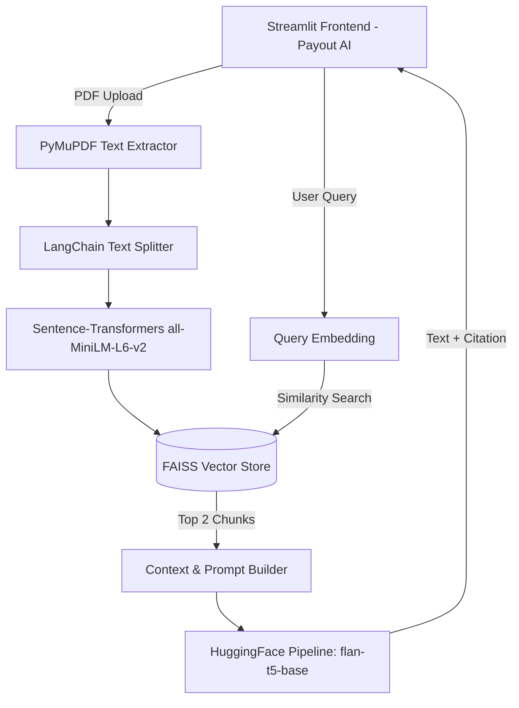
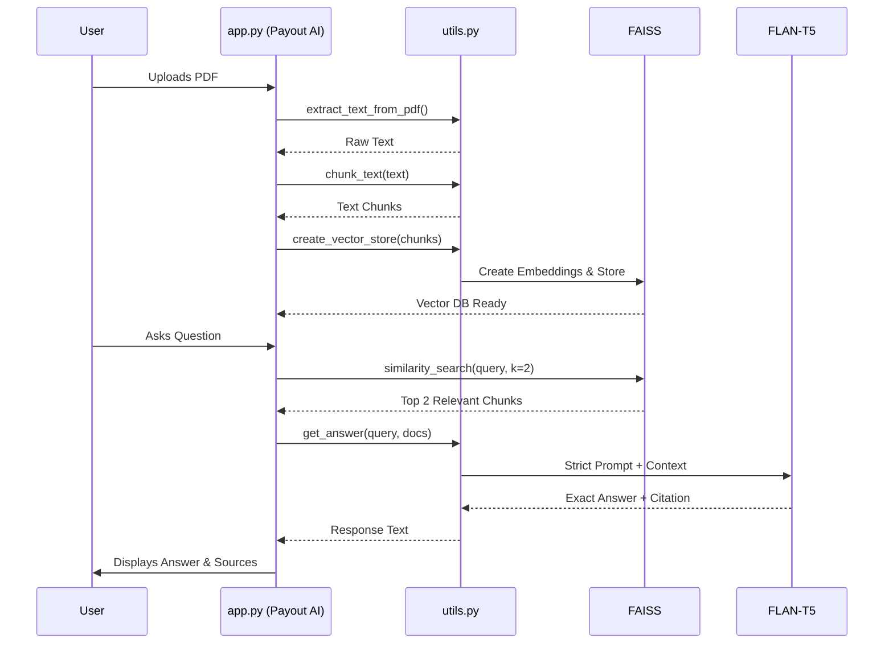

# 📊 Payout AI - Financial Intelligence System

A state-of-the-art **Retrieval-Augmented Generation (RAG)** application designed to analyze complex financial documents. This project transforms a basic Python notebook into a premium, interactive dashboard ("Payout AI") that provides expert-level financial insights.

---

## 🛠️ Project Workflow

The application follows a modular RAG pipeline to ensure accuracy and context-aware responses:

### High-Level Architecture


### Data Flow Diagram


1.  **Ingestion**: Extracts raw text from uploaded financial reports.
2.  **Processing**: Splits text into 1,000-character chunks with overlap to maintain context.
3.  **Indexing**: Converts chunks into vector embeddings and stores them in a local FAISS database.
4.  **Retrieval**: Performs a semantic search to find the most relevant document sections for any user query.
5.  **Inference**: A professional Financial Analyst prompt guides the LLM to explain concepts, formulas, and results.

---

## ✨ Features
- **Dynamic PDF Support**: Upload and process any PDF report in real-time.
- **Strict Citation Engine**: The AI extracts exact numbers and explicitly cites document references for 100% accuracy and zero hallucination.
- **Premium Deep Space UI**: A beautiful, glassmorphism-inspired dark mode dashboard with dynamic hover effects, gradients, and a responsive layout.
- **Interactive Chat History**: Your past queries are saved as interactive buttons in the "Recent Activity" tab—clicking them seamlessly reloads past context and sources.
- **Privacy First**: Runs 100% locally on your machine—no data leaves your computer.

---

## 🚀 Installation & Setup

### 1. Requirements
Ensure you have **Python 3.9+** installed.

### 2. Clone the Repository
```bash
git clone https://github.com/likhitha58/FINANCIAL-RAG-APP.git
cd FINANCIAL-RAG-APP
```

### 3. Install Dependencies
```bash
pip install -r requirements.txt
```

---

## 🏃 How to Run

1.  **Launch the Dashboard**:
    ```bash
    streamlit run app.py
    ```
2.  **Access the App**: Open your browser to `http://localhost:8501`.
3.  **Analyze**:
    - Upload a financial report via the sidebar under **Payout AI**.
    - Click **🚀 Process Analytics**.
    - Ask questions like: *"What is the debt to equity ratio?"* or *"Analyze the revenue growth."*

---

## 📁 Project Structure
- `app.py`: High-performance dashboard built with Streamlit, containing the Payout AI UI.
- `utils.py`: The core RAG intelligence engine managing embeddings, chunking, and LLM inference.
- `requirements.txt`: Project dependencies.
- `temp_uploads/`: Secure local storage for your analysis session.
